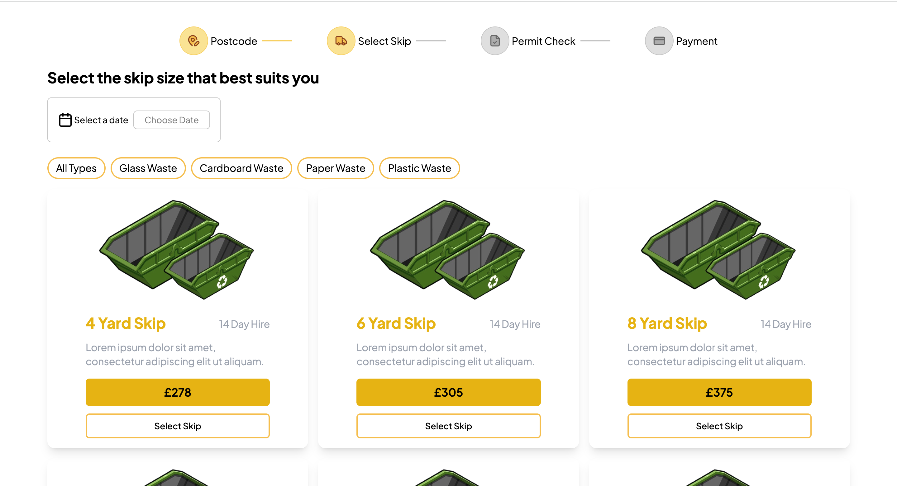
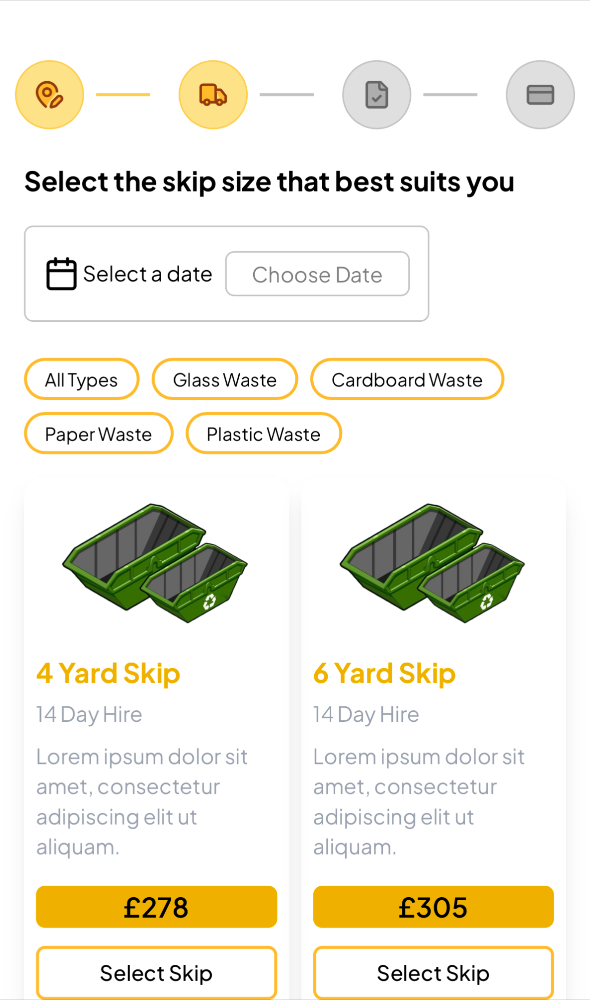

# We Want Waste ♻️

A responsive React application for selecting and ordering waste skips based on user location, built with modern libraries and patterns for performance, maintainability, and an intuitive user experience.

---
## 📸 Preview



## 🔍 Overview

* **Goal**: Provide a friendly interface where users enter their postcode, browse available skip options, confirm permit eligibility, and complete payment.
* **Tech Stack**:

  * **React + TypeScript** for type safety and modern composition.
  * **TanStack Query** for efficient data fetching and caching.
  * **Tailwind CSS** for fast, responsive, and consistent styling.
  * **Lucide React** icons for clean, customizable vector assets.

---

## ⚖️ High-Level Architecture

1. **Stepper Flow**
   Orchestrates a four-step user journey:

   * **Postcode** → **Select Skip** → **Permit** → **Payment**
   * Built with a custom flexible Stepper component, allowing for dynamic flow control and persisting progress.

2. **Skip Selector**
   Fetches skip data via TanStack Query, maps it into styled cards, and handles user selections.

3. **API Integration**

   * Uses `fetchSkips` via TanStack Query to retrieve `skips/by-location`.
   * Error, loading, and caching states managed automatically.

---

## 💡 Key Features & Decisions

### 1. **Stepper & Dynamic Icons**

* Passed icons as functions (`({ stroke, fill }) => <LucideIcon … />`) to allow dynamic styling based on step progress.
* Container decides active step styles and passes appropriate color props to icons.

### 2. **Data Fetching with TanStack Query**

* `useQuery(['skips', postcode], fetchSkips)` for skip data retrieval.
* Benefits:

  * Auto-caching and revalidation.
  * Loading & error state management.
  * Future-proofing for refetching on demand.

### 3. **Stateful Skip Cards**

* Selected skip ID managed via `useState`.
* Selected card reflected visually via color changes.
* UX-friendly UX with hover, selected styles.

### 4. **Styling with Tailwind**

* Card design: white background with shadow and rounded corners and yellow accents.
* Responsive grid layout for multiple screen sizes.
* Clear typography hierarchy for readability.

---

## 🛠️ Getting Started

```bash
git clone https://github.com/undercover-engineer/we-want-waste.git
cd we-want-waste
npm install
npm run dev
```

Ensure React Query’s `<QueryClientProvider>` wraps the app in `main.tsx`.
You can also access the live project on [https://undercover-we-want-waste.vercel.app/]
---

## ⚙️ Core Files

* **`App.tsx`** – Defines steps array, renders Stepper.
* **`Stepper.tsx`** – Handles navigation, active step logic, and icon rendering.
* **`SkipSelector.tsx`** – Fetches skip data, renders cards, maintains selection state.

---

## ✍️ Example: SkipSelector

```tsx
const fetchSkips = async () => {
  const res = await fetch('API_URL');
  if (!res.ok) throw new Error('Fetch failed');
  return res.json();
};

function SkipSelector() {
  const [selectedId, setSelectedId] = useState(null);
  const { data: skips, isLoading, isError } =
    useQuery(['skips', postcode], fetchSkips, { staleTime: 5 * 60_000 });
  
  if (isLoading) return <p>Loading...</p>;
  if (isError) return <p>Error loading skips.</p>;

  return (
    <div className="grid …">
      {skips.map(skip => (
        <div key={skip.id} …>
          <h3>{skip.sizeLabel}</h3>
          <p>£{skip.price}</p>
          <button onClick={() => setSelectedId(skip.id)}>
            {selectedId === skip.id ? 'Selected' : 'Select Skip'}
          </button>
        </div>
      ))}
    </div>
  );
}
```

---

## ✅ Learnings & Trade‑Offs

* **Icon styling approach** allows dynamic icon color changes based on state.
* **TanStack Query** enables smooth async data handling out of the box.
* Functional composition and clean separation of UI & data logic.
* Tailwind accelerates styling with consistent theming.
* Trade-offs: Managing state manually when persisting selections or syncing with global context.

---

## 🔮 Future Improvements

* Extend Stepper behavior: validation on each step, back-navigation, and optional skip.

---

## 👍 How to Contribute

Contributions are welcome! Suggestions, PRs, or issues for improvements/fixes are appreciated.

1. Fork the repository.
2. Create a feature branch.
3. Make your changes and update the README accordingly.
4. Submit a pull request (or merge directly if preferred).

---

## 📄 License

MIT License — feel free to use and modify the code as needed.

